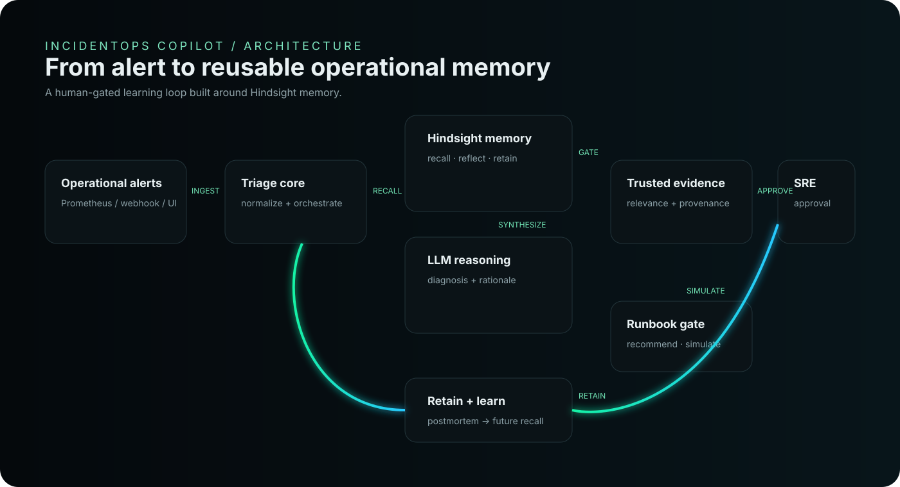
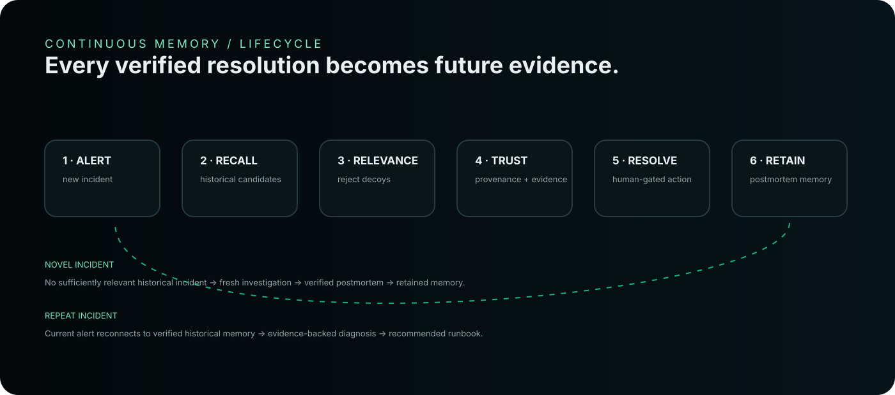
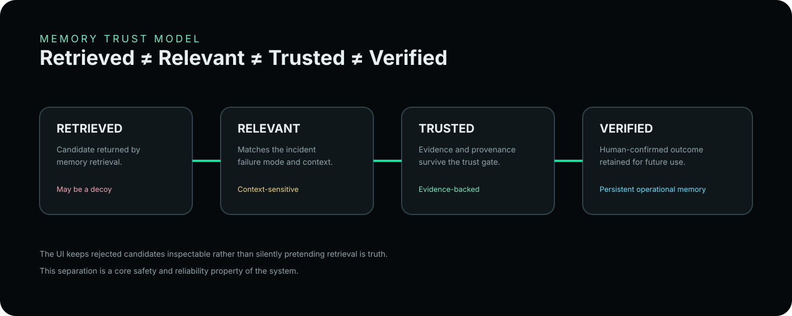

# IncidentOps Copilot

### SRE Continuous Memory Agent

> **Incidents remembered. Resolution repeated.**

IncidentOps Copilot is an SRE incident-response system built around a simple idea:

**An incident assistant should not start from zero every time.**

It recalls historical incidents through **Hindsight**, filters retrieval through a relevance and trust layer, uses an LLM for diagnosis synthesis, keeps remediation behind a human approval boundary, and turns verified postmortems into reusable operational memory.

**Live product:** https://incidentops-copilot.vercel.app

---

## The problem

Most AI incident assistants are effectively stateless:

~~~text
Alert → prompt → answer
~~~

That can produce a useful explanation, but it does not create an operational learning loop.

Real SRE teams repeatedly encounter related failure modes:

- connection-pool saturation
- cache failures
- certificate expiry
- queue or partition lag
- memory exhaustion
- deployment regressions
- dependency outages

The valuable knowledge is not only *what happened*. It is:

**what evidence mattered → what diagnosis was verified → what runbook worked → what should be remembered next time.**

IncidentOps Copilot turns that history into a first-class part of incident response.

---

## The core idea

### From stateless troubleshooting to continuous operational memory

~~~text
                     CURRENT INCIDENT
                            │
                            ▼
                     HINDSIGHT RECALL
                            │
                            ▼
                    RELEVANCE GATE
                 ┌──────────┴──────────┐
                 │                     │
              REJECT                 ACCEPT
                 │                     │
             DECOY / LOW          TRUSTED EVIDENCE
             RELEVANCE                 │
                                       ▼
                                AI DIAGNOSIS
                                       │
                                       ▼
                              RECOMMENDED RUNBOOK
                                       │
                                       ▼
                               HUMAN APPROVAL
                                       │
                                       ▼
                              RESOLUTION / SIMULATION
                                       │
                                       ▼
                                  POSTMORTEM
                                       │
                                       ▼
                              HINDSIGHT RETENTION
                                       │
                                       └──────► FUTURE RECALL
~~~

The key distinction is:

> **Retrieved ≠ Relevant ≠ Trusted ≠ Verified**

A retrieval result is a candidate—not automatically truth.

---

## See the architecture

### Continuous memory lifecycle

### Memory trust model

---

## Why Hindsight is central

Hindsight is not being used as a decorative vector database.

It is the **operational memory layer**.

IncidentOps Copilot uses the memory lifecycle to:

1. **Recall** historical incident candidates.
2. **Evaluate** their failure mode and context.
3. **Reject** misleading or weak candidates.
4. **Promote** evidence-backed memories into trusted context.
5. **Diagnose** the current incident using current + trusted historical evidence.
6. **Recommend** an operational runbook.
7. **Require human approval** before controlled action.
8. **Retain** the verified outcome as a structured postmortem.
9. **Recall it again** when the failure pattern returns.

This makes the system a learning loop rather than a one-shot chatbot.

---

# Incident states

## 01 — Known incident

A sufficiently relevant historical memory exists.

~~~text
Alert
  ↓
Hindsight recall
  ↓
Relevant historical incident
  ↓
Verified evidence
  ↓
Diagnosis
  ↓
Runbook recommendation
  ↓
Human approval
~~~

Example:

**Payment gateway 504 → PgBouncer saturation → verified pool configuration → approved runbook**

---

## 02 — Novel incident

No sufficiently relevant historical precedent exists.

~~~text
Alert
  ↓
Hindsight searched
  ↓
No trusted precedent
  ↓
Fresh first-principles investigation
  ↓
Human verification
  ↓
Postmortem retained
  ↓
Future memory
~~~

The first occurrence becomes the evidence for the next occurrence.

---

## 03 — Decoy memory

A candidate can be retrieved because it looks semantically similar while still being operationally wrong.

IncidentOps Copilot keeps that candidate visible in the trace but prevents it from silently becoming trusted evidence.

**This is intentional.**

A memory system that cannot reject bad memories is not a reliable incident system.

---

## 04 — Degraded memory

If Hindsight is unavailable, times out, rejects authentication, or otherwise degrades, the system does **not** fabricate a successful historical recall.

The application explicitly enters degraded behavior and can continue with first-principles reasoning where supported.

---

# Product experience

The frontend is designed around **operational memory as a spatial system**, not a generic dashboard.

### Command Center

The operational view connects:

**Active Incident → Hindsight Trace → Relevance → Evidence → Diagnosis → Runbook → Approval → Learning**

### Spatial Memory

A Three.js-based memory surface visualizes relationships between:

- Incidents
- Root causes
- Evidence
- Runbooks
- Postmortems
- Verified memories

### Trace Audit

Every important memory decision is inspectable:

- what was retrieved
- what was rejected
- why evidence was trusted
- what diagnosis was produced
- what runbook was recommended
- what was retained

---

# Trust model

The system deliberately uses four distinct states:

| State | Meaning |
|---|---|
| **Retrieved** | Returned by the memory retrieval layer |
| **Relevant** | Matches the current failure mode and context |
| **Trusted** | Survives evidence/provenance checks |
| **Verified** | Outcome has been confirmed and retained |

### Why this matters

Without this separation, an AI agent can take a plausible historical answer and turn it into false grounding.

IncidentOps Copilot instead makes the trust transition explicit.

---

# Human-in-the-loop by design

The model recommends.

The SRE approves.

Runbook actions are not treated as automatically executable merely because an LLM suggested them.

The application models the approval state explicitly and supports controlled simulation.

This boundary is part of the product—not an afterthought.

---

# Security & resilience

The repository includes dedicated controls and tests for:

- authentication and authorization
- runbook approval boundaries
- prompt-injection defenses
- memory provenance
- Hindsight failure handling
- circuit-breaker degradation
- webhook abuse protection
- webhook idempotency
- production-secret fail-closed behavior
- CORS / trusted proxy hardening
- persisted provenance
- persisted webhook state

See [docs/security.md](docs/security.md).

> **Security claim:** the system is deliberately designed with multiple safety boundaries and tested failure modes. It does not claim perfect security.

---

# Verification

## Current backend verification

**232 passed · 1 skipped · 0 failures**

Quality gates include:

| Gate | Purpose |
|---|---|
| **Ruff** | Python linting |
| **Mypy** | Static type checking |
| **pip-audit** | Dependency vulnerability audit |
| **Pytest** | Functional + security/reliability tests |
| **Docker build** | Container packaging verification |

The repository also contains dedicated evaluation code for memory quality, diagnosis quality, held-out behavior and scale experiments.

See [docs/evaluation.md](docs/evaluation.md).

### What we deliberately do not claim

This project does **not** claim:

- a measured percentage reduction in real-world MTTR
- production-scale Hindsight performance
- autonomous production remediation
- universal high availability
- perfect prompt-injection prevention
- perfect security

Those claims require operational evidence beyond this submission.

---

# Architecture

Detailed documentation:

- [docs/architecture.md](docs/architecture.md)
- [docs/memory-model.md](docs/memory-model.md)
- [docs/security.md](docs/security.md)
- [docs/evaluation.md](docs/evaluation.md)

---

# Technology

### Backend

- Python
- FastAPI
- Pydantic
- Hindsight
- Groq / LLM inference
- pytest
- Ruff
- Mypy

### Frontend

- React
- TypeScript
- Vite
- Three.js
- Lucide
- Tailwind CSS

### Engineering

- Docker
- GitHub Actions
- automated quality gates
- evaluation harnesses
- failure-mode testing

---

# Repository structure

~~~text
incidentops-copilot-submission/
│
├── app/                         # FastAPI backend
│   ├── api/                    # HTTP/API routes
│   ├── models/                 # Typed domain models
│   ├── services/               # Hindsight, LLM, runbook, triage
│   └── data/                   # Seed/demo incident corpus
│
├── src/                        # React frontend
│   ├── components/
│   │   └── stitch/             # Stitch-derived product views
│   └── ...
│
├── tests/                      # Backend verification suite
├── scripts/                    # Evaluation + demo utilities
├── reports/                    # Evaluation outputs
├── assets/                     # Repository architecture visuals
├── docs/                       # Engineering documentation
│
├── .github/workflows/          # CI quality gates
├── Dockerfile
├── docker-compose.yml
├── requirements.txt
├── package.json
└── README.md
~~~

---

# Run locally

## Backend

Create a local environment from the example configuration:

~~~bash
cp .env.example .env
~~~

Install dependencies:

~~~bash
pip install -r requirements.txt
~~~

Start FastAPI:

~~~bash
python -m uvicorn app.main:app --host 127.0.0.1 --port 8000 --reload
~~~

API documentation:

~~~text
http://localhost:8000/docs
~~~

## Frontend

~~~bash
npm install
npm run dev
~~~

Build verification:

~~~bash
npm run build
~~~

## Test

~~~bash
pytest -v
ruff check app/
mypy app/
pip-audit -r requirements.txt
~~~

---

# Demo scenarios

The repository contains utilities for exercising the continuous-learning loop:

~~~bash
python scripts/seed_hindsight.py
python scripts/simulate_alert.py --scenario redis
python scripts/simulate_alert.py --scenario novel
~~~

Additional evaluation utilities live under [scripts/](scripts/).

---

# Engineering philosophy

IncidentOps Copilot is built around five principles:

### 01 — Memory is evidence, not decoration

Historical incidents must be useful to the current problem.

### 02 — Retrieval is not truth

A semantic match can still be a decoy.

### 03 — Automation needs a boundary

The agent can recommend. Human operators retain control over action.

### 04 — Failure is a product state

Memory outages and degraded dependencies should be visible—not hidden behind fabricated success.

### 05 — Measure what you can defend

The repository favors reproducible tests and explicit limitations over impressive but unverified numbers.

---

# Known limitations

This is a hackathon-grade system and should be evaluated within that scope.

Known limitations include:

- process-local rate limiting
- single-node persistence choices
- in-memory runbook registry
- heuristic prompt-injection defenses
- no production-scale Hindsight performance evidence
- no measured real-world MTTR reduction
- no autonomous production remediation
- no second commercial LLM provider demonstrated in production

These are documented intentionally so the implementation can be evaluated on evidence rather than marketing claims.

---

# Roadmap

Potential next steps for a production evolution:

- distributed rate limiting
- durable runbook registry
- stronger policy enforcement around remediation
- broader observability integrations
- larger held-out memory evaluations
- production-scale Hindsight benchmarking
- richer RBAC and organization tenancy
- stronger adversarial evaluation of prompt-injection defenses

---

# Project status

**Core implementation:** complete  
**Backend verification:** 232 passed · 1 skipped · 0 failures  
**Frontend:** deployed  
**Memory architecture:** implemented  
**Continuous learning loop:** implemented  
**Human approval boundary:** implemented  
**Evaluation harness:** included

---

## The idea in one sentence

> **IncidentOps Copilot turns incident history into reusable, evidence-gated operational memory—so the next incident does not have to start from zero.**

**Incidents remembered. Resolution repeated.**

---

### Links

- **Live Demo:** https://incidentops-copilot.vercel.app
- **Repository:** https://github.com/rohith4521/incidentops-copilot-submission
- **Hindsight:** https://github.com/vectorize-io/hindsight
